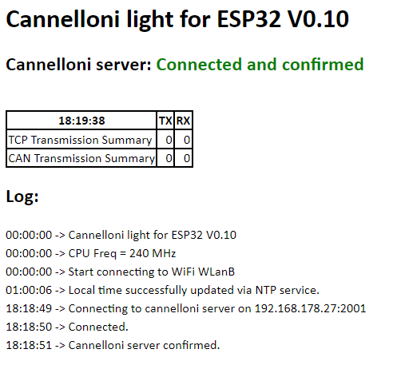

# Cannelloni light for ESP32
TCP tunnel for CAN bus data

Supports TCP communication only, no UDP

Sopports standard CAN frames only

Based on project cannelloni: https://github.com/mguentner/cannelloni 

**This is beta stage software. Don't use in productive environment.**

### Background
Project cannelloni provides bidirectional transfer of CAN frames between two (linux) machines using IP protocols UDP, TCP or SCTP.

This projects runs one cannelloni node on an ESP32 controller. A typical setup can look like this:

{physical can bus} <-> {can tranceiver} <-> {ESP32} <-> WiFi <-> {linux machine} <-> {virtual can bus} <-> {application}

### Hardware
Beside the linux machine, e.g. a raspberry pi, you need
* ESP32 dev kit, e.g. [this](https://www.amazon.de/KeeYees-Bluetooth-Internet-Entwicklungsboard-ESP-WROOM-32/dp/B08TBPBJGV/ref=sr_1_29?dib=eyJ2IjoiMSJ9.lvAmX3kb20wVzwOkSJ5hlSNOy-PoBZzuEBRa2NwVxMRxKaE688RLmv0bySbHAKxoo-viHSg8CteSxoe3mpZrma77IpbtpY0u-lcrSfwFv3TIBg_yADvP-qeyj_wWHWb5tpkd63Hl9p8SJWzoop4SZL-36f2JKBj7ki4AEuRaET4qRodsU4dwoOL0F3kaAKUp75cPhNG9O7HYieLHN-sY4_aO-UY-4Oecz-zjgekEXkqK_AcFu2Gq3dsRJIoNQ3Fz9KVSzwxGxK3byTMPbUtn7J0lNiVrXdzpUeCpOwNaTKc.5PxPgAt0FpAP4RR0V_t3JdMtFp5HpWN0pIcxk42lHk0&dib_tag=se&keywords=keeyees&qid=1709743502&sr=8-29)
* CAN transceiver, e.g. [this](https://www.amazon.de/ICQUANZX-SN65HVD230-CAN-Bus-Modul-Kommunikationsmodul-CAN-Bus-Transceiver/dp/B07VG3Z9GT/ref=sr_1_3_pp?__mk_de_DE=%C3%85M%C3%85%C5%BD%C3%95%C3%91&crid=1V7BTY599BDBS&dib=eyJ2IjoiMSJ9.alIvsaUcyWUnd_60uU5R-4tn3sHJysON1mAGKVyYd1sn52M7W2Smr7i7RAF2CNzvvsFgtVPh2GT_H6UC8NLeL3FVj0O8K6J8CnDkU-lqNhjV8q6QsfiQgkV8jZ_IUWeP7CGqVvcs5eorV6RSmKVJjKKdDZBRvM3kjK9v3BWng2qXfnq5CA8JHbvxm_6z3XqLV7snJ6aS688xOKCUG-SUCb_tn3Z4LPH2eikifLEfLNTgNjcs1BcIQfE_TMw8Fdo7-1gcp8ih4gE_fu3GSuA8aDdzca9LipnVfu7dSePxNFE._vHhuKTrXBHio4s0kNWiIHI-qenhF9AlIw90WmkvnTQ&dib_tag=se&keywords=SN65HVD230&qid=1709743461&s=ce-de&sprefix=sn65hvd230%2Celectronics%2C183&sr=1-3) or [this](https://www.amazon.de/SN65HVD230-Transmitter-PCA82C250-Protection-Automotive/dp/B0C4Y79KTD/ref=sr_1_3?__mk_de_DE=%C3%85M%C3%85%C5%BD%C3%95%C3%91&crid=1V7BTY599BDBS&dib=eyJ2IjoiMSJ9.alIvsaUcyWUnd_60uU5R-4tn3sHJysON1mAGKVyYd1sn52M7W2Smr7i7RAF2CNzvvsFgtVPh2GT_H6UC8NLeL3FVj0O8K6J8CnDkU-lqNhjV8q6QsfiQgkV8jZ_IUWeP7CGqVvcs5eorV6RSmKVJjKKdDZBRvM3kjK9v3BWng2qXfnq5CA8JHbvxm_6z3XqLV7snJ6aS688xOKCUG-SUCb_tn3Z4LPH2eikifLEfLNTgNjcs1BcIQfE_TMw8Fdo7-1gcp8ih4gE_fu3GSuA8aDdzca9LipnVfu7dSePxNFE._vHhuKTrXBHio4s0kNWiIHI-qenhF9AlIw90WmkvnTQ&dib_tag=se&keywords=SN65HVD230&qid=1709741737&s=ce-de&sprefix=sn65hvd230%2Celectronics%2C183&sr=1-3)
* Connect ESP32 to CAN transceiver: 3.3V, GND, GPIO21 <-> TX, GPIO22 <-> RX. If you use different GPIOs, pls. adapt assignments in `user_config.h` accordingly.
* Connect CAN_L and CAN_H of transceiver to the physical CAN bus. It's good idea to use twisted pair cable. Conncetion of GND is optional. Check, if a termination is needed (120 Ohm).

### Software
To build and flash **VSCode with PlatformIO** or **Arduino IDE** can be used.
* This project is using VScode
* If you prefer Arduino IDE please create a new project, copy content of file `main.cpp` to your sketch and copy file `user_config.h` to the same folder.

### Get started
* Install [CAN library by Sandeep Mistry](https://github.com/sandeepmistry/arduino-CAN/blob/master/README.md)
* Edit `user_config.h`
    * set ssid and password four your WiFi
    * adapt host address and port of cannelloni server on linux side
    * check pin assignments for connection to can transceiver
    * adapt CAN baudrate
    * limit range of CAN IDs to what you really need (speed and resources of a ESP32 are limited!). 
* Build the project and flash it to the ESP32
* Start virtual CAN bus and cannelloni server on you linux host. Please refer to cannelloni project for details.
* Important: Start cannelloni as server for TCP protocol, e.g. for vcan0 and port 2001:
```
cannelloni -I vcan0 -C s -p -t 20000 -l 2001
```
* cannelloni now will wait for connection of a client
* Power on the ESP32. After a couple of seconds it should connect to the cannelloni server
* ESP32cannelloni provides a simple web interface reachable under `http://ESP32cannelloni/` or `http://ESP32cannelloni.local` dependent on your network configuration.

