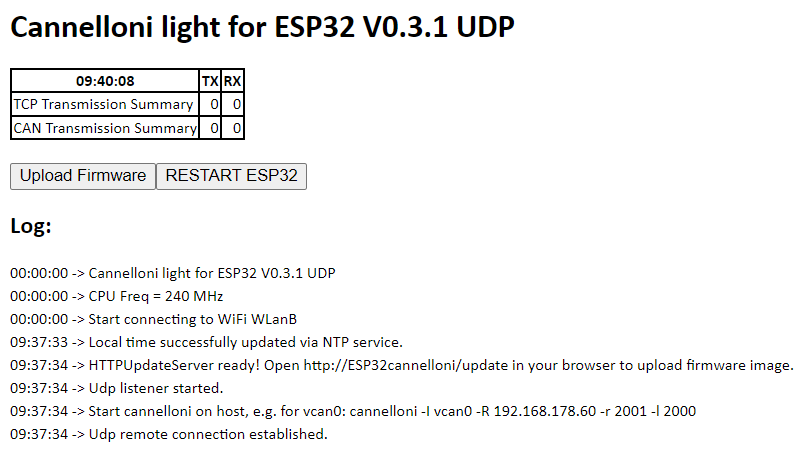

# Cannelloni light for ESP32
TCP/IP tunnel for CAN bus data

Supports UDP and TCP communication, use of UDP is recommended

Sopports standard CAN frames only

Based on project cannelloni: https://github.com/mguentner/cannelloni 

**This is beta stage software. Don't use in productive environment.**

### Background
Project cannelloni provides bidirectional transfer of CAN frames between two (linux) machines using IP protocols UDP, TCP or SCTP.

This projects runs one cannelloni node on an ESP32 controller. A typical setup can look like this:

{physical can bus} <-> {can tranceiver} <-> {ESP32} <-> WiFi <-> {linux machine} <-> {virtual can bus} <-> {application}

For linux implementation please refer to [documentaion of project cannelloni](https://github.com/mguentner/cannelloni). Another very good description is available [here](https://crycode.de/socketcan-ueber-ethernet-mit-cannelloni).

### Hardware
Beside the linux machine, e.g. a raspberry pi, you need
* ESP32 dev kit, e.g. [this](https://amzn.eu/d/9v9HkSA)
* CAN transceiver, e.g. [this](https://amzn.eu/d/dyoJX4t) or [this](https://amzn.eu/d/5HjQusO)
* Connect ESP32 to CAN transceiver: 3.3V, GND, GPIO21 <-> TX, GPIO22 <-> RX. If you use different GPIOs, pls. adapt assignments in `user_config.h` accordingly.
* Connect CAN_L and CAN_H of transceiver to the physical CAN bus. It's good idea to use twisted pair cable. Conncetion of GND is optional. Check, if a termination is needed (120 Ohm).

### Software
To build and flash **VSCode with PlatformIO** or **Arduino IDE** can be used.
* This project is using VScode
* If you prefer to use Arduino IDE please create a new project, copy content of file `main.cpp` to your sketch and copy file `user_config.h` to the same folder.

### Get started
* Install [CAN library by Sandeep Mistry](https://github.com/sandeepmistry/arduino-CAN/blob/master/README.md)
* Edit `user_config.h`
    * decide to use UDP (default) or TCP protocol (undefine `UDP_PROTOCOL` by commenting out the coressesponing line) for data exchange with cannelloni host.
    * set ssid and password four your WiFi
    * adapt host address and port of cannelloni server on linux side
    * check pin assignments for connection to can transceiver
    * adapt CAN baudrate
    * limit range of CAN IDs to what you really need (speed and resources of a ESP32 are limited!). 
* Build the project and flash it to the ESP32
* Start virtual CAN bus and cannelloni server on you linux host. Please refer to cannelloni project for details.
* When using **UDP protocol**:
    * Power on the ESP32
    * Start cannelloni as suggested in cannelloni docs, e.g. for vcan0, ESP32 running on 192.168.178.43, port 2000 & 2001: `cannelloni -I vcan0 -R 192.168.178.43 -r 2001 -l 2000`
    * The correct command line will be shown on web interface after start up of ESP32
* When using **TCP protocol**:
    * Start cannelloni as server for TCP protocol, e.g. for vcan0 and port 2001: `cannelloni -I vcan0 -C s -p -t 20000 -l 2001`
    * cannelloni now will wait for connection of a client
    * Power on the ESP32. After a couple of seconds it should connect to the cannelloni server
* ESP32cannelloni provides a simple web interface reachable under `http://ESP32cannelloni/` or `http://<IP-address-of-ESP32>/`

## Changelog
<!--
    Placeholder for the next version (at the beginning of the line):
    ### **WORK IN PROGRESS**
-->

### 0.3.0 (2024-04-10)
* (MyHomeMyData) Added option for Web-Updates, added Reset-Button

### 0.2.2 (2024-04-10)
* (MyHomeMyData) Force restart of ESP32 after 5 consecutive failures of UDP send attempts

### 0.2.1 (2024-04-04)
* (MyHomeMyData) Bugfix: Avoid resets during startup

### 0.2.0 (2024-03-31)
* (MyHomeMyData) Added support for UDP protocol

### 0.1.2 (2024-03-28)
* (MyHomeMyData) Force attempt to reconnect to cannelloni server in case of TCP communication error
* (MyHomeMyData) Force restart of ESP32 in case of stalled TCP communication

### 0.1.1 (2024-03-23)
* (MyHomeMyData) Reset CAN buffer on connection to cannelloni server

### 0.1.0 (2024-03-06)
* (MyHomeMyData) Initial version
